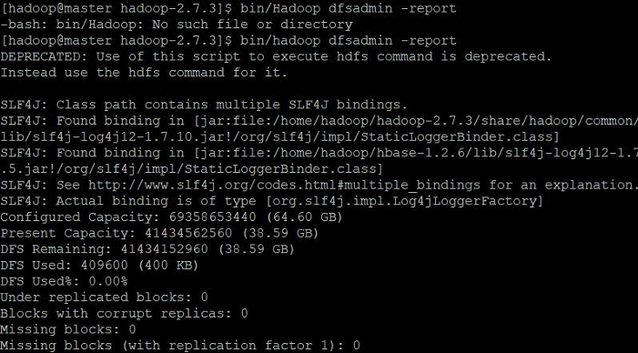

# Hadoop的在虚拟机上的配置和安装
## 前期准备

- 平台：Windows10
-  虚拟机软件：VMware 16.2.2
- [Linux镜像：CentOS 7.2.1511](http://mirror.nsc.liu.se/centos-store/7.2.1511/isos/x86_64/)


## 安装虚拟机
- 虚拟机：3台
- 安装步骤：
    1. 打开Vmware 
    2. 创建新的虚拟机 
    3. 典型 
    4. 选择镜像 
    5. 创建用户 
    6. 配置界面

### 网络配置
- 点击VMware首选项的**虚拟网络编辑器**

    

- 检查VMnet8(NAT模式)的**子网IP**和**子网掩码**

    

    这里的子网IP是`192.168.220.0`,子网掩码是`255.255.255.0`

### 配置的选择
- 内存：6GB+
- 硬盘：20GB+
- CPU：至少1核心
- 网络：NAT模式（VMnet8）保证3台机器在同一个虚拟网络下


### 开机后需要做的一些事
#### 设置网络
- 先找到接口名称   

    

这里是eno16777736
- 去到相应的接口进行配置的修改
    ```bash
    vi /etc/sysconfig/network-scripts/ifcfg-eno16777736  
    ```
- 填入相应的网络配置
    ```bash
    IPADDR=192.168.220.130 
    PREFIX=24             
    GATEWAY=192.168.220.2  
    DNS1=8.8.8.8           
    DNS2=114.114.114.114   
    ```
重启网络
```bash
systemctl restart network
```
确认虚拟机的网络连接
```bash
ping 192.168.220.131 # 在192.168.220.130 ping 192.168.220.131
```
确定外部网络的连接和DNS工作是否正常
```bash
ping www.baidu.com
```

#### 设置主机名
打开hosts文件
```bash 
vim /etc/hosts
```
在hosts的内容清空，根据节点的IP换成以下内容，**3个节点都需要**
```vim
192.168.220.130 master
192.168.220.131 slave1
192.168.220.132 slave2
```
重启网络
```bash
systemctl restart network
```
确认hosts文件是否生效
```bash
ping master
```
### 新建hadoop用户
新建用户
```bash
sudo useradd hadoop
sudo passwd hadoop
```
给用户root权限（在root下设置）
```bash
visudo
```
再打开的文件的指定位置输入
```bash
hadoop ALL=(ALL) ALL
```


## 环境配置
### 所有节点都需要的配置
#### java安装和环境变量配置
建立一个`java`目录
```bash
mkdir /usr/java
```
获得jdk的压缩包
```bash
wget https://mirrors.tuna.tsinghua.edu.cn/Adoptium/8/jdk/x64/linux/OpenJDK8U-jdk_x64_linux_hotspot_8u422b05.tar.gz --no-check-certificate
```
移动压缩包到建立的文件夹
```bash
mv ./OpenJDK8U-jdk_x64_linux_hotspot_8u422b05.tar.gz /usr/java
cd /usr/java
```

解压文件夹
```bash
tar -zxvf  ./OpenJDK8U-jdk_x64_linux_hotspot_8u422b05.tar.gz
```
打开~/.bashrc配置`java`环境变量
```bash
vi ~/.bashrc
```
在文件末尾加入以下内容
```bash
export JAVA_HOME=/usr/java/jdk8u422-b05
export CLASSPATH=.:$JAVA_HOME/jre/lib/rt.jar:$JAVA_HOME/lib/dt.jar:$JAVA_HOME/lib/tools.jar
export PATH=$PATH:$JAVA_HOME/bin
```
激活环境变量
```bash
source ~/.bashrc
```

#### 关闭防火墙
停止防火墙
```bash
sudo systemctl stop firewalld
```
关闭开机启动
```bash
sudo systemctl disable firewalld
```

#### 配置节点间相互无密码登录
生成密钥
```bash
ssh-keygen
```
传递密钥
```bash
ssh-copy-id hadoop@slave1
```
**注意master，slave1，slave2三个都要配置一遍**

### master节点的mysql的配置与安装
1. [配置阿里云yum源](https://blog.csdn.net/g310773517/article/details/140321025)
2. 添加mysql的信息
    ```bash
    yum clean all
    yum makecache
    yum update
    wget http://dev.mysql.com/get/mysql57-community-release-el7-8.noarch.rpm
    yum localinstall ./mysql57-community-release-el7-8.noarch.rpm
    yum repolist enabled | grep "mysql.*community.*"
    yum install mysql-community-sever
    ```
3. 启动mysql，设置mysql开机启动
    ```bash
    systemctl start mysqld
    systemctl enable mysqld
    ```
4. 设置mysql密码
    - 查看临时密码
        ```bash 
        grep 'temporary password' /var/log/mysqld.log
        ```
    - 用临时密码登录mysql
        ```bash 
        mysql
        ```
    - 进入mysql后
        ```sql
        SET PASSWORD = PASSWORD('Hadoop@123');
        CREATE USER 'hadoop'@'%' IDENTIFIED BY 'Hadoop@123';
        grant all on *.* to 'root'@'%' identified by 'Hadoop@123';
        grant all on *.* to 'hadoop'@'%' identified by 'Hadoop@123';
        FLUSH PRIVILEGES;
        quit;
        ```

### 时区同步

#### master节点
安装ntp,打开ntp配置文件
```bash
yum install ntp
chkconfig ntpd on
vim /etc/ntp.conf
```
将服务器设为以下内容，将其他server注释
```bash
server cn.pool.ntp.org iburst
```

重启查看状态
```bash
service ntpd restart 
systemctl status ntpd.service
```
#### 其他节点
打开chrony配置
```bash
vi /etc/chrony.conf
```
设置服务器，将其他server注释
```bash
server 192.168.220.130 iburst 
```
重启查看状态
```bash
service chronyd restart
chronyc sources
```
## Hadoop的安装和配置
### 前置
- [`jdk1.8`](https://mirrors.tuna.tsinghua.edu.cn/Adoptium/8/jdk/x64/linux/)
- [`Hadoop2.7.3`](https://archive.apache.org/dist/hadoop/core/hadoop-2.7.3/)   
- `MySQL5.7`
### 下载和安装
- 切换用户为`hadoop`,三个节点都创建；若没创建，请参照[创建hadoop用户](./hadoop/installer-hadoop.md?id=新建hadoop用户)
，不切换需要新建一个文件夹`/home/hadoop/`(不推荐)
- 获得Hadoop tar格式压缩包后，解压压缩包到`/home/hadoop/`
    ```bash 
    mv ./hadoop-2.7.3.tar.gz /home/hadoop/
    cd /home/hadoop/
    tar –xzvf ./hadoop-2.7.3.tar.gz
    ```
- 配置环境变量文件hadoop-env.sh
    ```bash 
    vim /home/hadoop/hadoop-2.7.3/etc/hadoop/hadoop-env.sh
    ```
    在文件靠前的部分找到下面的一行代码：
    ```bash
    export JAVA_HOME=${JAVA_HOME}
    ```
    修改为
    ```bash
    export JAVA_HOME=/usr/java/jdk8u422-b05
    ```
    保存文件退出
- 配置环境文件yarn-env.sh
    ```bash
    vim /home/hadoop/hadoop-2.7.3/etc/hadoop/yarn-env.sh
    ```
    找到文件靠前的部分找到下面的一行代码
    ```bash
    # export JAVA_HOME=/home/y/libexec/jdk1.6.0/
    ```
    修改为下面的内容
     ```bash
    export JAVA_HOME=/usr/java/jdk8u422-b05/
    ```
- 新建hadoop产生文件的目录
    ```bash
    mkdir /home/hadoop/hadoopdata
    ```
### 配置文件的修改
- `/home/hadoop/hadoop-2.7.3/etc/hadoop/core-site.xml`
  ```xml
    <?xml version="1.0" encoding="UTF-8"?>
    <?xml-stylesheet type="text/xsl" href="configuration.xsl"?>
    <!-- Put site-specific property overrides in this file.-->
    <configuration>
    <!--指定namenode的地址-->
        <property>
            <name>fs.defaultFS</name>
            <value>hdfs://master:9000</value>
        </property>
        <!--用来指定使用hadoop时产生文件的存放目录-->
        <property>
            <name>hadoop.tmp.dir</name>
            <value>/home/hadoop/hadoopdata</value>
        </property>
    </configuration>
  ```
- `/home/hadoop/hadoop-2.7.3/etc/hadoop/hdfs-site.xml`
    ```xml
    <?xml version="1.0" encoding="UTF-8"?>
    <?xml-stylesheet type="text/xsl" href="configuration.xsl"?>
    <!-- Put site-specific property overrides in this file.-->
    <configuration>
    <!--指定hdfs保存数据的副本数量-->
        <property>
            <name>dfs.replication</name>
            <value>1</value>
        </property>
    </configuration>
    ```
- `/home/hadoop/hadoop-2.7.3/etc/hadoop/yarn-site.xml`
    ```xml
    <?xml version="1.0"?>
    <configuration>

        <!--nomenodeManager 获取数据的方式是shuffle-->
        <property>
        <name>yarn.nodemanager.aux-services</name>
        <value>mapreduce_shuffle</value>
        </property>

        <!--指定Yarn中ResourceManager的地址-->
        <property>
        <name>yarn.resourcemanager.address</name>
        <value>master:18040</value>
        </property>

        <property>
        <name>yarn.resourcemanager.scheduler.address</name>
        <value>master:18030</value>
        </property>
        <property>

        <name>yarn.resourcemanager.resource-tracker.address</name>
        <value>master:18025</value>
        </property>
        
        <property>
        <name>yarn.resourcemanager.admin.address</name>
        <value>master:18141</value>
        </property>
        <property>

        <name>yarn.resourcemanager.webapp.address</name>
        <value>master:18088</value>
        </property>
    </configuration>
    ```
  
- `/home/hadoop/hadoop-2.7.3/etc/hadoop/mapred-site.xml`
  - 先使用CP命令复制mapred-site-template.xml文件为mapred-site.xml：
    ```bash
    cp /home/hadoop/hadoop-2.7.3/etc/hadoop/mapred-site.xml.template /home/hadoop/hadoop-2.7.3/etc/hadoop/mapred-site.xml
    ```

  - 用下面的代码替换mapred-site.xml中的内容。
    ```xml
    <?xml version="1.0"?>
    <?xml-stylesheet type="text/xsl" href="configuration.xsl"?>
    <configuration>

    <!--指定MR(Map/Reduce)运行在YARN上-->
        <property> 
        <name>mapreduce.framework.name</name>
        <value>yarn</value>
        </property>
    </configuration>
    ```
- ` /home/hadoop/hadoop-2.7.3/etc/hadoop/slaves`
    ```
    slave1
    slave2
    ```
- 使用下面的命令将hadoop文件复制到其他节点，本实验中为slave1和slave2，命令如下
  ```bash
    [hadoop@master ~]$ scp -r hadoop-2.7.3 hadoop@slave1:/home/hadoop/
    [hadoop@master ~]$ scp -r hadoop-2.7.3 hadoop@slave2:/home/hadoop/
  ```
- 将下面的代码追加到**3个节点**`~/.bashrc`的末尾
  ```bash
    export PATH
    export CLASSPATH=.:$JAVA_HOME/jre/lib/rt.jar:$JAVA_HOME/lib/dt.jar:$JAVA_HOME/lib/tools.jar
    export PATH=$PATH:$JAVA_HOME/bin
    export HADOOP_HOME=/home/hadoop/hadoop-2.7.3
    export PATH=$HADOOP_HOME/bin:$HADOOP_HOME/sbin:$PATH
    export JAVA_HOME=/usr/java/jdk8u422-b05
  ```
- 保存退出,使用`source`激活**3个节点**的环境变量
    ```bash
    source ~/.bashrc
    ```
  ## 启动Hadoop集群
  1. 格式化文件系统
    ```bash
    hdfs namenode-format
    ```
  2. 启动Hadoop集群，先切换到`/home/hadoop/hadoop-2.7.3/`目录下
   ```bash
    cd /home/hadoop/hadoop-2.7.3/
    bash sbin/start-all.sh
   ```
  3. 查看进程是否启动
    - 在master输入`jps`指令
     
        

    - 在slave输入`jps`指令
  
        

    - 在master输入`bin/hadoop dfsadmin -report`检查`hadoop`集群
        ```bash
        /home/hadoop/hadoop-2.7.3/bin/hadoop dfsadmin -report
        ```

        

  4. WebUI 检查是否成功启动
    - 在浏览器地址栏中输入`http://master:50070/`检查`namenode`和`datanode`是否正常
     
        

    - 在浏览器输入`http://master:18088/`检查`YARN`是否正常
  
        

  5. 运行PI实例检查集群是否成功
    ```bash
    hadoop jar /home/hadoop/hadoop-2.7.3/share/hadoop/mapreduce/hadoop-mapreduce-examples-2.7.3.jar pi 100 100000000
    ```
    - 运行过程
  
        
        
    - 运行结果

        


