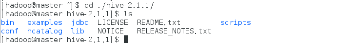
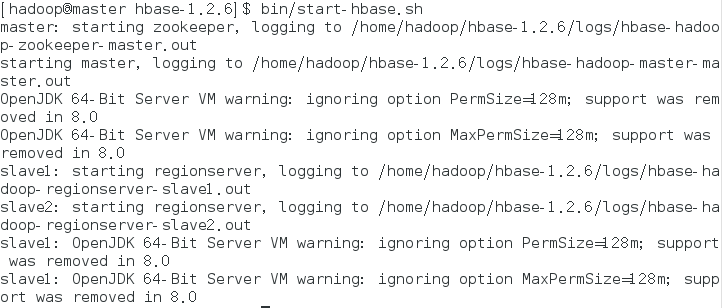
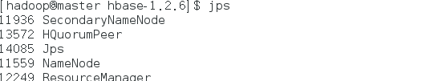
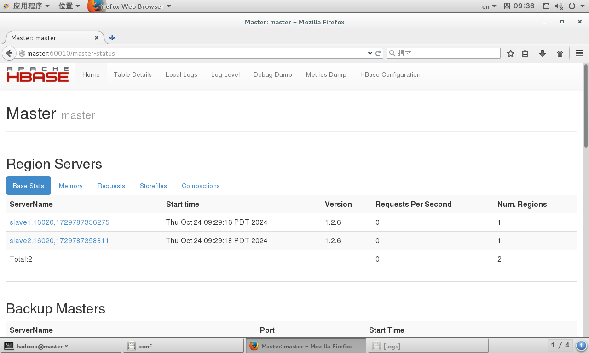

# HBase的安装和配置
## 前置条件
- `Hadoop 2.7.3`
- `jdk 1.8`

## HBase的安装

> 这里我们选择`HBase 1.2.6`,[点击进行下载](https://archive.apache.org/dist/hbase/1.2.6/),选择bin后缀的tar文件下载
### 下载并解压
> 下载连接可能会失效
```bash
cd ./home/hadoop
wget https://archive.apache.org/dist/hbase/1.2.6/hbase-1.2.6-bin.tar.gz --no-check-certificate 
tar -zxvf ./hbase-1.2.6-bin.tar.gz
```
查看目录结构
```bash
cd ./hbase-1.2.6 && ls
```



### 配置HBase
```bash
cd /home/hadoop/hbase-1.2.6/conf
```
- 配置`hbase-env.sh`
    ```bash
    vim hbase-env.sh
    ```
    该文件的靠前部分有下面一行内容：
    ```bash
    # export JAVA_HOME=/usr/java/jdk1.6.0/
    ```
    将改行内容修改为：
    ```bash
    export JAVA_HOME=/usr/java/jdk8u422-b05
    ```
- 修改配置文件`hbase-site.xml`。
    ```xml
    <?xml version="1.0"?>
    <?xml-stylesheet type="text/xsl" href="configuration.xsl"?>
        <configuration>
        <!--HBase 的运行模式，false是单机模式，true是分布式模式。若为false,HBase和Zookeeper会运行在同一个JVM里面!-->
            <property>
                <name>hbase.cluster.distributed</name>
                <value>true</value>
            </property>
            <!--region server 的共享目录，用来持久化HBase!-->
            <property>
                <name>hbase.rootdir</name>
                <value>hdfs://master:9000/hbase</value>
            </property>
            <property>
            <!--Zookeeper 集群的地址列表!-->
                <name>hbase.zookeeper.quorum</name>
                <value>master</value>
            </property>
            <!--HBase Master web 界面端口!-->
            <property>
                <name>hbase.master.info.port</name>
                <value>60010</value>
            </property>
        </configuration>
    ```
- 设置`regionservers`
    > `HRegionServer`是`HBase`中最主要的组件，负责Table数据的实际读写，管理`Region`。在分布式集群中，`HRegionServer`一般跟`DataNode`在同一个节点上,目的是实现数据的本地性，提高读写效率。
    
    将`regionservers`中的 localhost修改为下面的内容：
  
    ```bash
    vim regionservers
    ```
    ```
    slave1
    slave2
    ```
- 设置环境变量
    ```bash
    vim ~/.bashrc
    ```
    将以下代码添加到文件末尾
    ```bash
    export HBASE_HOME=/home/hadoop/hbase-1.2.6
    export PATH=$HBASE_HOME/bin:$PATH
    export HADOOP_CLASSPATH=$HBASE_HOME/lib/*
    ```
    激活新设置的环境变量
    ```
    source ~/.bashrc
    ```
- 拷贝Hbase    
    > 执行下面的命令，将`HBase`安装文件复制到另外两个节点`slave1`和`slave2`上。
    ```bash 
    scp -r /home/hadoop/hbase-1.2.6 slave1:/home/hadoop
    scp -r /home/hadoop/hbase-1.2.6 slave2:/home/hadoop
    ```
## 启动Hbase和验证
- 启动 
    ```bash
    cd /home/hadoop/hbase-1.2.6
    bin/start-hbase.sh
    ```
  执行命令后会看到如图
  
- `master`和`slave`节点上执行jps查看java进程
    - `master`
    
    - `slave`
    

- WebUI界面查看启动情况
    > 打开Firefox浏览器，在地址栏中输入`http://master:60010`

    
- 启动不成功并和`zookeeper`有关，有可能时权限不够，`hbase`文件不能被访问和执行
    >提供`hadoop`用户权限
    ```bash
    sudo chmod 777 -R /home/hadoop/hbase-1.2.6
    ```