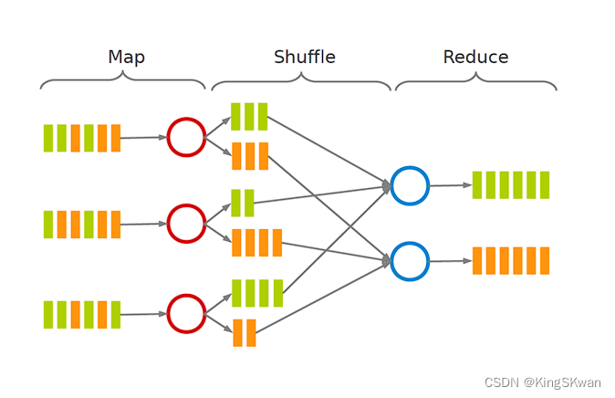
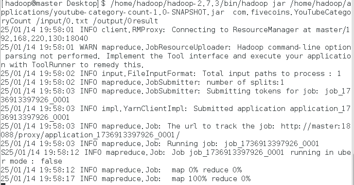
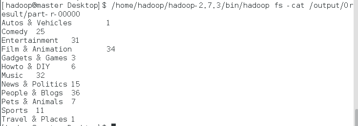

# MapReduce
> MapReduce 是一个分布式计算框架，由Google在2004年提出，由Google的Jeffrey Dean和Hadoop的Brian Goetz开发，并在2008年发布。
> - Map是映射，用于将输入数据进行分割，并把分割后的数据发送到Reduce进行处理。
> - Reduce是规约，用于对分割后的数据进行聚合处理，并把聚合后的数据发送到输出端。

## MapReduce工作流程


## MapReduce做Youtube社交数据集的类别归纳任务
### 1. 下载数据集
> 数据集下载地址：
https://netsg.cs.sfu.ca/youtubedata/

Youtube数据集是一个包含约1000万条记录的社交网络数据集，其中包含用户上传的视频信息，包括视频的类别、上传时间、点赞数、评论数等。数据集的每一行表示一个视频，每一列表示一个属性，如视频的类别、上传时间、点赞数、评论数等。


### 2. java源码并用maven构建生成jar包
```java
package com.fivecoins;
import org.apache.hadoop.conf.Configuration;
import org.apache.hadoop.fs.Path;
import org.apache.hadoop.io.Text;
import org.apache.hadoop.mapreduce.Job;
import org.apache.hadoop.mapreduce.Mapper;
import org.apache.hadoop.mapreduce.Reducer;
import org.apache.hadoop.mapreduce.lib.input.FileInputFormat;
import org.apache.hadoop.mapreduce.lib.output.FileOutputFormat;

import java.io.IOException;
public class YouTubeCategoryCount {
    public static class TokenizerMapper extends Mapper<Object, Text, Text, Text> {
        private final static Text one = new Text("1");
        private Text word = new Text();

        public void map(Object key, Text value, Context context) throws IOException, InterruptedException {
            String[] columns = value.toString().split("\t");
            if (columns.length > 3) { // 确保列数足够
                String category = columns[3]; // category列的索引为3
                word.set(category);
                context.write(word, one);
            }
        }
    }

    public static class IntSumReducer extends Reducer<Text, Text, Text, Text> {
        private Text result = new Text();

        public void reduce(Text key, Iterable<Text> values, Context context) throws IOException, InterruptedException {
            int sum = 0;
            for (Text val : values) {
                sum += Integer.parseInt(val.toString());
            }
            result.set(String.valueOf(sum));
            context.write(key, result);
        }
    }

    public static void main(String[] args) throws Exception {
        Configuration conf = new Configuration();
        Job job = Job.getInstance(conf, "YouTube Category Count");
        job.setJarByClass(YouTubeCategoryCount.class);
        job.setMapperClass(TokenizerMapper.class);
        job.setCombinerClass(IntSumReducer.class);
        job.setReducerClass(IntSumReducer.class);
        job.setOutputKeyClass(Text.class);
        job.setOutputValueClass(Text.class);
        FileInputFormat.addInputPath(job, new Path(args[0]));
        FileOutputFormat.setOutputPath(job, new Path(args[1]));
        System.exit(job.waitForCompletion(true) ? 0 : 1);
    }
}

```
pom.xml
```xml
<?xml version="1.0" encoding="UTF-8"?>
<project xmlns="http://maven.apache.org/POM/4.0.0"
         xmlns:xsi="http://www.w3.org/2001/XMLSchema-instance"
         xsi:schemaLocation="http://maven.apache.org/POM/4.0.0 http://maven.apache.org/xsd/maven-4.0.0.xsd">
    <modelVersion>4.0.0</modelVersion>

    <groupId>org.example</groupId>
    <artifactId>youtube-category-count</artifactId>
    <version>1.0-SNAPSHOT</version>

    <properties>
        <maven.compiler.source>8</maven.compiler.source>
        <maven.compiler.target>8</maven.compiler.target>
        <project.build.sourceEncoding>UTF-8</project.build.sourceEncoding>
        <hadoop.version>2.7.3</hadoop.version>
    </properties>

    <dependencies>
        <!-- Hadoop Common -->
        <dependency>
            <groupId>org.apache.hadoop</groupId>
            <artifactId>hadoop-common</artifactId>
            <version>${hadoop.version}</version>
        </dependency>

        <!-- Hadoop HDFS -->
        <dependency>
            <groupId>org.apache.hadoop</groupId>
            <artifactId>hadoop-hdfs</artifactId>
            <version>${hadoop.version}</version>
        </dependency>

        <!-- Hadoop MapReduce Client Core -->
        <dependency>
            <groupId>org.apache.hadoop</groupId>
            <artifactId>hadoop-mapreduce-client-core</artifactId>
            <version>${hadoop.version}</version>
        </dependency>

        <!-- Hadoop Client -->
        <dependency>
            <groupId>org.apache.hadoop</groupId>
            <artifactId>hadoop-client</artifactId>
            <version>${hadoop.version}</version>
        </dependency>
    </dependencies>

    <build>
        <plugins>
            <plugin>
                <groupId>org.apache.maven.plugins</groupId>
                <artifactId>maven-compiler-plugin</artifactId>
                <version>3.8.1</version>
                <configuration>
                    <source>1.8</source>
                    <target>1.8</target>
                </configuration>
            </plugin>
            <plugin>
                <groupId>org.apache.maven.plugins</groupId>
                <artifactId>maven-shade-plugin</artifactId>
                <version>3.2.4</version>
                <configuration>
                    <createDependencyReducedPom>false</createDependencyReducedPom>
                </configuration>
                <executions>
                    <execution>
                        <phase>package</phase>
                        <goals>
                            <goal>shade</goal>
                        </goals>
                        <configuration>
                            <transformers>
                                <transformer implementation="org.apache.maven.plugins.shade.resource.ManifestResourceTransformer">
                                    <mainClass>com.fivecoins.YouTubeCategoryCount</mainClass>
                                </transformer>
                            </transformers>
                        </configuration>
                    </execution>
                </executions>
            </plugin>
        </plugins>
    </build>
</project>
```
### 3. 在hadoop上集群运行
- 开启hdfs
```bash
bash /home/hadoop/hadoop-2.7.3/sbin/start-all.sh
```

- 上传数据到hdfs
  - 把jar文件和txt复制移到/home/hadoop/applications/
  - 在hdfs创建output目录：
    ```bash
    hadoop fs -mkdir -p /output
    ```
  - 在hdfs创建input目录：
    ```bash
    hadoop fs -mkdir -p /input
    ```
  - 把数据集移进去后（移动到）：
    ```bash
    hadoop fs -put /home/hadoop/applications/*.txt  /input
    ```
  - 查看是否成功：
  ```bash
  hadoop fs -ls /input/
  ```
  - 运行mapreduce：
  ```bash
  /home/hadoop/hadoop-2.7.3/bin/hadoop jar /home/hadoop/applications/youtube-category-count-1.0-SNAPSHOT.jar  com.fivecoins.YouTubeCategoryCount /input/0.txt /output/0result
  ```
  
  - 查看输出结果：
  ```bash
  /home/hadoop/hadoop-2.7.3/bin/hadoop fs -cat /output/0result/part-r-00000
  ```
  