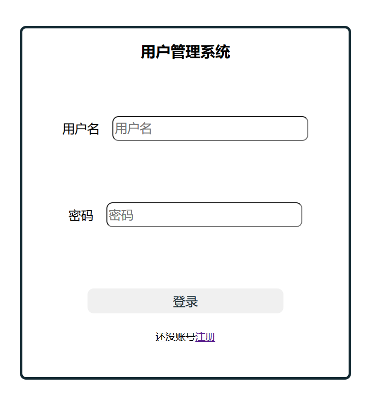
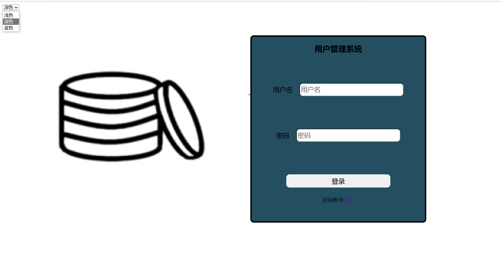

# css的主题选择
在前端开发中，我们经常会遇到需要切换主题的需求，比如白天黑夜模式的切换，或者是不同的主题色。这里我们就来看看如何实现这个功能。

## css 变量
> css变量是通过js改变style变量，从而改变css样式的一种方法。

- 我们首先定义一个具有css变量的登录框，如下：
```html
    <div class="login-box" >
        <form>
            <h2>用户管理系统</h2>
            <div>
                <label>用户名</label>
                <input type="text" placeholder="用户名" id="yourName"/>
            </div>

            <div>
                <label>密码</label>
                <input type="password" placeholder="密码" id="yourPassword"/>
            </div>
            <div>
                <button type="button" class="btn-primary" onclick="login()">登录</button>
            </div>
            <p>还没账号<a href="./register.html">注册</a></p>
        </form>
    </div>
<style>

    .login-box{
        margin: 0px;

        width: 70%;
        height: 70%;
        background-color: var(--theme-color);
        border: 4px solid var(--theme-color-light);
        border-radius: 10px;
        align-items: center;
        justify-content: center;
    }
</style>
```
- 那么好了，现在这个变量还未存在，我们怎么去定义呢？我们可以通过js来定义，如下：
```js
    // 定义一个css变量
    document.documentElement.style.setProperty('--theme-color', '#fff');
    document.documentElement.style.setProperty('--theme-color-light', '#000');
```
- 好了，到现在我们就能得到一个白色的登录框了，


- 我们现在要做一个主题切换，可用做一个选择框，并且配合js，对选择框的改变进行响应，对style变量改变，如下：
```html
    <select id="theme-selector">主题
        <option value="light">浅色</option>
        <option value="dark">深色</option>
        <option value="blue">蓝色</option>
    </select>
    <script>
        changeTheme(sessionStorage.getItem("theme") || "light");
        function changeTheme(theme) {
            if (theme == "light") {
                document.body.style.setProperty("--theme-color", "white");
                document.body.style.setProperty("--theme-color-light", "#122932");
                sessionStorage.setItem("theme", "light");
            } else if (theme == "dark") {
                document.body.style.setProperty("--theme-color", "#234f60");
                document.body.style.setProperty("--theme-color-light", "black");
                sessionStorage.setItem("theme", "dark");
            }else if (theme == "blue") {
                document.body.style.setProperty("--theme-color", "blue");
                document.body.style.setProperty("--theme-color-light", "black");
                sessionStorage.setItem("theme", "blue");
            }
        }

        document.getElementById("theme-selector").addEventListener("change", function (e) {
            changeTheme(e.target.value);
        });
    </script>
```
- 这样我们就能实现主题的切换了，如下：



