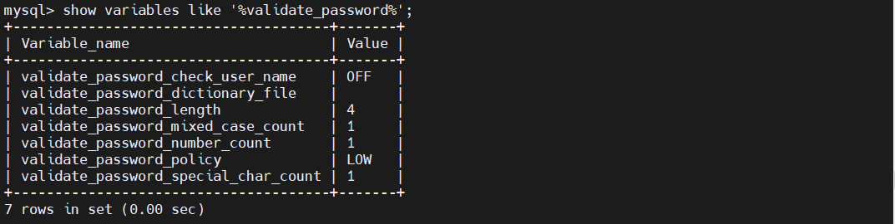

# 对数据的操作

# 增删改查

## insert

## delete

## update

## select

# 用户权限的操作

## grant

## revoke

# 设置

## 密码验证设置

### 查看密码检查规定
```sql
    show variables like '%validate_password';    
```

### 修改相关项
```sql
    set global validate_password_policy=MEDIUM;
```

