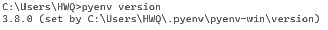
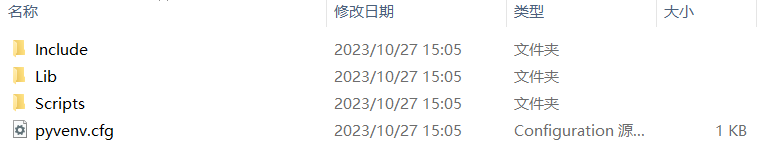
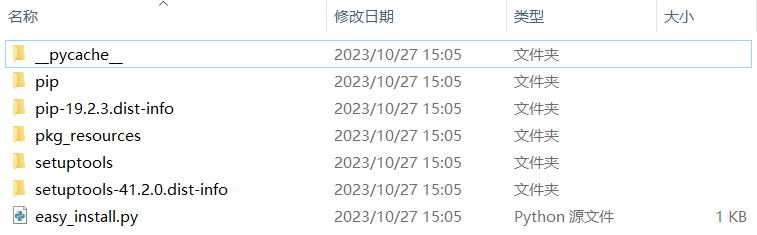
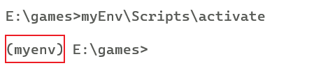
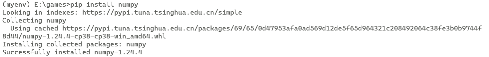

# Python 环境的配置
> 我们常常需要切换Python的版本和使用不同的依赖，如果全部将其放到本地的Python解释器是不现实的，因此我们要将每个不同的环境隔离开，最好就是一个项目一个环境

## 平时虚拟环境用过3种：
* [conda](https://zhuanlan.zhihu.com/p/638540652)
* pyenv
* python3 -m venv xxx
  
`conda`是一个非常全面的环境管理工具，但是我比较少用，并且前人已经将其用法总结的很好了，这里我将详细介绍后两种
## `pyenv`的安装
```cmd
https://github.com/pyenv/pyenv#installation
```

## `pyenv`的使用

* ### install/uninstall
     `pyenv`的使用非常简单,首先我们应该给系统安装一个`python`吧，这里我们装一个`python 3.10.11`,直接使用如下命令  
    
    ```cmd 
    pyenv install 3.10.11 
    ```
    卸载`uninstall`也是一样的道理
* ### update
    更新`pyenv`的源
    ```cmd  
    pyenv update
    ```
* ### local/global
  - 选择全局默认环境
    ```cmd
    pyenv global 3.8.0 
    ```
  - 选择本文件夹下的环境
    ```cmd
    pyenv global 3.10.11
    ```
* ### version
  使用`version`查看当前的环境和设置的文件夹
  ```cmd 
  pyenv version
  ```
  
* ### which
    `which`可以用于查找处于pyenv目录下的命令
    ```cmd
    pyenv which python
    ```
### `pyenv`常用指令
|commands|usage|
|----|----|
|duplicate|Creates a duplicate python environment|
|local|Set or show the local application-specific Python version|
|global|Set or show the global Python version|
|shell|Set or show the shell-specific Python version|
|install|Install a Python version using python-build|
|uninstall|Uninstall a specific Python version|
|update|Update the cached version DB|
|rehash|Rehash pyenv shims (run this after installing executables)|
|vname|Show the current Python version|
|version|Show the current Python version and its origin|
|version-name|Show the current Python version|
|versions|List all Python versions available to pyenv|
|exec|Runs an executable by first preparing PATH so that the selected Python|
|which|Display the full path to an executable|
|whence|List all Python versions that contain the given executable|

## `venv`的使用
> `venv`是`python`自带的一个虚拟环境管理工具，使用起来也非常简单
* ### 创建虚拟环境
    ```cmd
    python3 -m venv myEnv
    ```
    可以看到，一个虚拟环境的文件夹已经建好

    

    这是文件夹的内容

    

    Lib里面含有基础的Python编译器和pip包管理器

    
  
* ### 使用虚拟环境
    ```bash
    source myEnv/bin/activate #bash
    myEnv\Scripts\activate #cmd
    ```

    

    可以看到，我们的命令行前面多了一个`(myEnv)`，这就说明我们已经进入了虚拟环境，我们可以在这里安装我们需要的包

    ```cmd
    pip install numpy
    ```

    
    
    可以看到，我们的包已经安装好了,注意哦，这个包只会安装到该环境，如果我们退出环境，全局的环境不含这个包，我们则用不了这个包，这样就实现环境的隔离了。

* ### 退出虚拟环境
    ```cmd
    deactivate
    ```
    

* ### 删除环境
    在不占用环境的情况下，我们把文件夹删除，即可删除环境
  
# linux下的环境配置
## 准备工作
```
首先要确认目标linux服务器已经安装了 wget，curl等工具方便我们从git上拉去pyenv的项目，如果没有安装对应的工具，需要切换到root用户下安装。
记住要先切回个人目录下再进行对应操作
```

### 安装git
```cmd
yum install git
```

### 更新yum源
```cmd
sudo yum update
```

### 安装pyenv环境管理python版本
```cmd
git clone https://github.com/pyenv/pyenv.git ~/.pyenv
echo 'export PYENV_ROOT="$HOME/.pyenv"' >> ~/.bashrc
echo 'export PATH="$PYENV_ROOT/bin:$PATH"' >> ~/.bashrc
echo 'eval "$(pyenv init -)"' >> ~/.bashrc
echo 'eval "$(pyenv virtualenv-init -)"' >> ~/.bashrc
#使配置生效
source ~/.bashrc
```

### 安装pip
```cmd
sudo yum install python-pip
```

### 安装python版本
```cmd
pyenv install 3.10.11
```