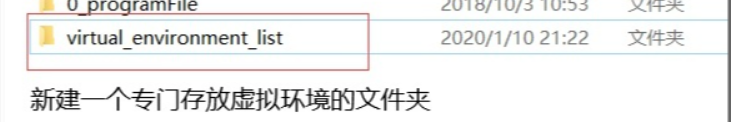

# PyTroch


# Python
## 打开文件
```python 
#第一种
f = open('foo/bar',"r",encoding="utf-8")
#第二种
with open('foo/bar',"wr",encoding="gbk")
```
## pip 与 虚拟环境 
>在python3.3后的版本中，我们可以通过 `python -m venv 虚拟环境名称`  创建虚拟环境

创建成功后，我们可以得到一个拥有本机python和pip的初始文件夹

我们可以在文件夹下的Scripts找到activate脚本进行激活环境，这样，我们在命令行执行的python脚本将默认在该虚拟环境下运行

- 首先要新建一个专门存放虚拟环境的文件夹。

- 在当前目录下新建一个虚拟环境venvdemo，包会下载在这个同名文件夹下
```bash
python -m venv venvdemo
```

- 激活虚拟环境
```bash
venvdemo\Scripts\activate
```

- 关闭虚拟环境
```bash
deactivate
```
## VScode 绑定虚拟环境

ctrl + shift + p 打开命令面板，输入python:select interpreter，选择虚拟环境下的python.exe


### 配置Vscode
1. 可以打开设置，添加python的venv目录
2. 也可以在setting中指定运行的解释器
```json
{
    "python.defaultInterpreterPath":"D:\\py_env\\test_env\\Scripts\\python.exe",
}
```
