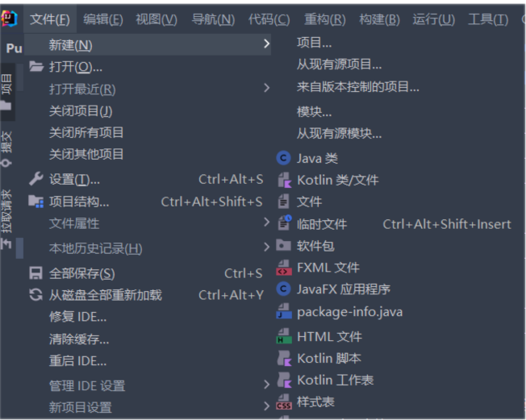
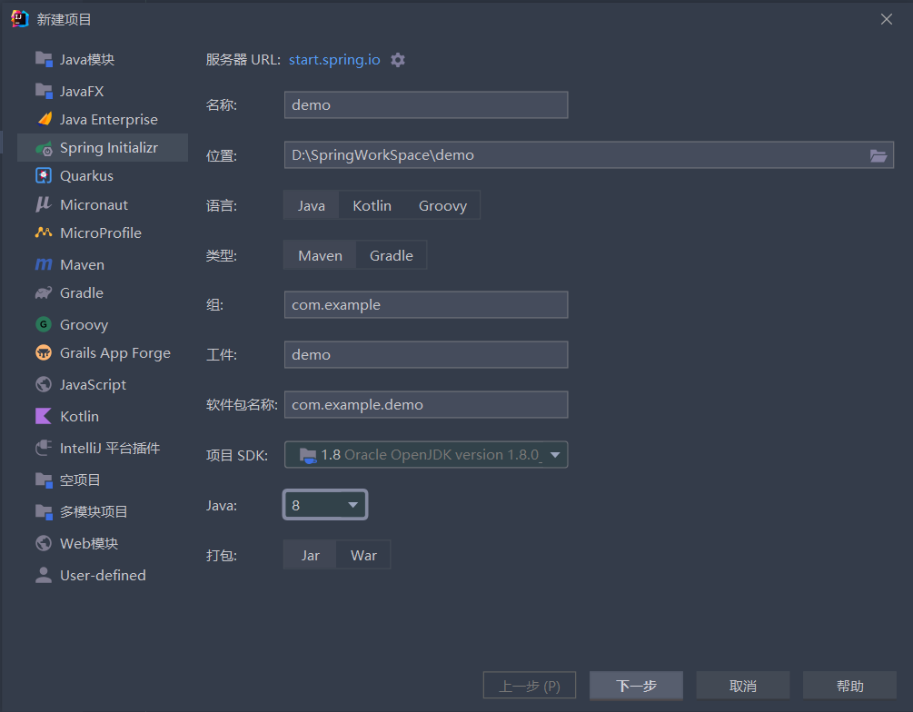
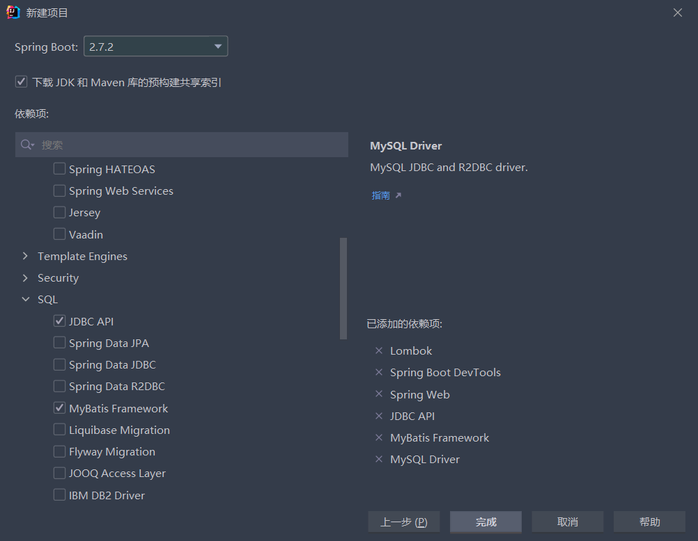

# SpringBoot

> 官网: [https://spring.io/projects/spring-boot/](https://spring.io/projects/spring-boot/)

### Idea新建SpringBoot项目
- #### 新建项目

- #### 名称，位置自由选择；java版本选择老版本 java8

- #### 选择预先加载项

|组件|功能|
| ---- | ---- |
|Spring Web|Web基本套件（Web开发必须要）|
|Spring Boot DevTools|一组开发工具，最重要提供热部署（自动重启项目）
|Lombok|一个java库，有很多实用工具
|JDBC API|java数据库链接
|MyBatis Framework|一个持久层框架，简化了jdbc的编写
|MySQL Driver|MySQL数据库的驱动，选择其他数据库就用其他数据库的驱动

