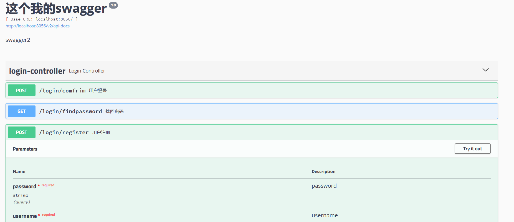

# Swagger
> swagger可以将接口图形化的展示给使用的人员，配置后，他会自动寻找Controller并进行接口的暴露，十分方便和快捷。
## 导包，有两个包swagger
```xml
        <dependency>
            <groupId>io.springfox</groupId>
            <artifactId>springfox-swagger2</artifactId>
            <version>2.9.2</version>
        </dependency>

        <dependency>
            <groupId>io.springfox</groupId>
            <artifactId>springfox-swagger-ui</artifactId>
            <version>2.9.2</version>
        </dependency>
```
- 这里注意，springboot的版本最后不要太高，这里能用的版本是2.5.11
## swagger配置
```java
@Configuration
@EnableSwagger2
public class SwaggerConfig{
    @Bean
    public Docket createRestapi() {
        return new Docket(DocumentationType.SWAGGER_2)
                .apiInfo(apiInfo())
                .select()
                //扫描包（需要扫描api的包）
                .apis(RequestHandlerSelectors.basePackage("com.example.fenghuoshixi.controller"))
                .paths(PathSelectors.any())
                .build();
    }

    //swagger显示页面的一些基本信息
    private ApiInfo apiInfo() {
        return new ApiInfoBuilder()
                .title("这个我的swagger")
                .description("swagger2")
                .termsOfServiceUrl("")
                .version("1.0")
                .build();
    }

}
```
## 使用方法
1. Controller中在类外用@Api注解，每个请求用@ApiOperation注解

```java
@RestController
@Api("用户登录")
@CrossOrigin
@RequestMapping("/login")
public class LoginController {
    @ApiOperation("用户登录")
    @PostMapping("/comfrim")
    public String login(@RequestParam("username") String username,@RequestParam("password") String password){
        return "登录成功";
    }

    @ApiOperation("用户注册")
    @PostMapping("/register")
    public String register(@RequestParam("username") String username,@RequestParam("password") String password){
        return "注册成功";
    }

    @ApiOperation("找回密码")
    @GetMapping("/findpassword")
    public String find(@RequestParam("username") String username){
        return "找回密码";
    }
}
```
- 效果


2. @ApiParam
> `@ApiParam`用于方法参数和成员变量

|||
|----|----|
| name| 可以作用于方法参数和成员变量|
|value| 参数别名|
|required |是否必须需要 |

3. @ApiIgnore
> `@ApiIgnore`:忽略当前注解描述的方法和类型

4. @ApiModel和@ApiModelProperty
> `@ApiModel`描述一个实体类型，这个实体类型如果成为任何一个生成api帮助文档方法的一个返回值类型的时候，此注解被解析

|||
|----|----|
| value | 自定义实体 |
|description| 详细描述|

> `@ApiModelProperty`实体类属性描述

|||
|----|----|
|name|字段别名|
|value|字段描述|
|required|是否是必须字段|
|example|示例数据|
|hidden|是否隐藏数据|