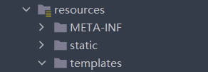

# Thymeleaf
>是一款易用的模板引擎，在SpringBoot上使用环境较好

# 如何快速使用
##### maven引入pom.xml
```xml
<dependency>
            <groupId>org.springframework.boot</groupId>
            <artifactId>spring-boot-starter-thymeleaf</artifactId>
</dependency>
```

##### html文件放置位置
在resources下的新建文件夹templates中


##### 在html文件的开头加入命名空间
```html
<html xmlns:th="http://www.thymeleaf.org">
```
##### controller写法
现在有一个html文件叫index.html在templates文件下
```java
@Controller
public class indexController {
   @GetMapping("/index")
    String indexPage(Model model){
        return "index";       //template视图解析器会自动添加.html后缀，这里不用加
    }
}
```
这样跳转就经过thymeleaf解析器了

---


# ${}取值符号
> 带上th命名空间的属性可以使用${}符号取后端model传来的对象。

## 用法
1. 直接访问对象属性`th:text="${obj.name}"`  
2. 访问对象方法的值`th:href="${obj.getName()}"`

## 示例
### 后端
```java
@GetMapping("/index")
    String indexPage(Model model){
        model.addAttribute("icons",iconService.getAllIcons());  //通过model的addAttribute()方法
        return "index.html";
    }
```
### 前端
```html
    <a th:href="${icon.urlPath}">
        
        <span th:text="${icon.getIconName}"></span>
    </a>
```
---


# @{}链接URL
> 通常和th:href搭配使用，表明这是一个路径或路由

## 用法
1. 取参数的`th:href="@{index.position}"`
2. 替代参数的`th:href="@{/order/{orderId}/details(orderId=${o.id})}"`


---


# th:each
>用于取一组元素，并且可以简化html的编写，每组元素可以再生成一段重复的标签

## 用法
`th:each="obj:${objs}"`

## 示例
### 后端
```java
    @GetMapping("/index")
    String indexPage(Model model){
        model.addAttribute("icons",iconService.getAllIcons());  //通过model的addAttribute()方法
        return "index.html";
    }
```

### 前端
```html
    <div th:each="icon:${icons}" th:class="${icon.htmlClass}">                       
        <!--要重复的元素-->
        <div class="card">
            <div class="card-body">
                <a th:href="${icon.urlPath}" th:target="newblog" class="logoContent">
                    
                    <span class="card-text" style="color:#2a3746;" th:text="${icon.iconName}"></span>
                </a>
            </div>
        </div>
        <!--要重复的元素-->
    </div>
```
---


# 按钮事件th:onclick 
>THYMELEAF 3.0.10更改日志
>*改进了HTML事件处理程序属性（th：on ），以允许将其值作为内联JavaScript的片段（使用JAVASCRIPT模板模式）进行处理。

##### 以前的写法（已弃用）
###### 方式一
`<button class="btn" th:onclick="'getName(\'' + ${person.name} + '\');'">获得名字</button>`

###### 方式二
`<button class="btn" th:onclick="'getName(' + ${person.name} + ');'">获得名字</button>`

###### 方式三
`<button th:onclick="|getName(${person.name} )|">获得名字</button>`

##### 现在的写法
`<button class="btn" th:onclick="getName([[${person.name}]]);">获得名字</button>`