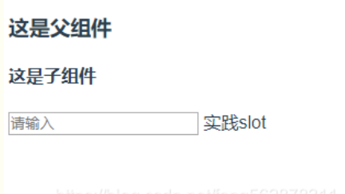
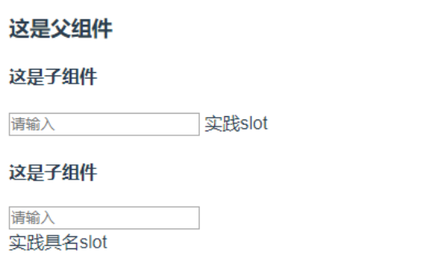
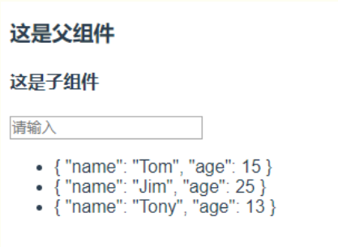

---

# vue中的插槽
## 插槽用来干嘛
父组件在调用子组件时，可以在子组件特定的位置中间插入内容
- 父组件
```html
<template>
  <div>
    <h3>这是父组件</h3>
    <son>实践slot</son>
  </div>
</template>
```
- 子组件
```html
<template>
  <div>
    <h4>这是子组件</h4>
    <input type="text" placeholder="请输入">
  </div>
</template>
```
一般我们的组件都会怎么写，但是这么写的话，会发现子组件中的实践slot是显示不出来的。如果需要让他显示出来，这时我们就可以用到插槽slot了。所以插槽相当于写好的组件留下的接口，满足一些定制化需求。

## 默认插槽
首先，子组件中我们要添加插槽slot，
```html
<template>
  <div>
    <h4>这是子组件</h4>
    <input type="text" placeholder="请输入">
    <slot></slot>
  </div>
</template>
```
这时，终于出现了slot。slot的位置就会出现父组件中实践slot这几个大字。

如图：


可以看到，这里面slot是没有名称的，顾名思义，这是插槽中的默认插槽。
## 具名插槽
然后在看看具名插槽，直接上代码，一目了然，
- 父组件
```html
<template>
  <div>
    <h3>这是父组件</h3>
    <son><span>实践slot</span></son>
    <son>
       <template slot="myslot">
          <div>实践具名slot</div>
       </template>
    </son>
  </div> 
</template>
```
- 子组件
```html
<template>
  <div>
    <h4>这是子组件</h4>
    <input type="text" placeholder="请输入">
    <slot></slot>
    <slot name="myslot"></slot>
  </div>
</template>
```
可以看出，和默认插槽不同的是，在子组件中，我们给插槽一个name属性，这个就是插槽的名称，同时在父组件中，我们在需要将内容插入的地方标签上加了一个slot属性，他的值就是我们的slot 名称name。

效果如下图：


上面就是2中插槽，默认插槽和具名插槽的用法。
## 作用域插槽
下来是slot-scope。slot-scope是作用域插槽。

官网中有一句特别强调的话：父组件模板的所有东西都会在父级作用域内编译；子组件模板的所有东西都会在子级作用域内编译。简单的所，就是父组件中不能直接用自组件中定义的data数据。而slot-scope的出现就是解决了这样的问题。如下代码

- 父组件
```html
<template lang="">
  <div>
    <h3>这是父组件</h3>
    <son>
      <template slot="myslot" slot-scope="scope">
        <ul>
          <li v-for="item in scope.data">{{item}}</li>
        </ul>
      </template>
    </son>
  </div> 
</template>
```

-子组件
```html
<template>
  <div>
    <h4>这是子组件</h4>
    <input type="text" placeholder="请输入">
    <slot name="myslot" :data='list'></slot>
  </div>
</template>
 
<script>
  export default {
    name:'Son',
    data(){
      return{
        list:[
          {name:"Tom",age:15},
          {name:"Jim",age:25},
          {name:"Tony",age:13}
        ]
      }
    }
  }
</script>

```
首先先看下效果，

其中，下方三个对象的值，我们本身是在子组件中定义的，按照官方文档中说的，本来父组件中是无法显示出来这些数据的，但是为什么现在显示出来了呢？？？这就要归功于我们强大的slot-scope了。

首先，在子组件中的插槽上有一句data="list"，而在父组件中也有slot-scope="scope"，slot-scope就是取data的值，slot-scope的值是自定义的，我们可以取任何名称，但是data的值传过来时是以对象形式传输的，所以在这scope.data才是list的值。

这样我们就可以在父组件中取到子组件的值，并且加以应用了。

## element-ui巧用作用域插槽
> 在el-table将:data中每一行的`row`, `column`, `$index` 和 `store`（table 内部的状态管理）放在当前行叫做scope的作用域插槽中，我们可以通过slot-scope来调用。
1. 利用插槽传行值调用对话框dialog
```html
<el-table-column label="操作" width="300">
    <template slot-scope="scope">
        <el-button
        size="small"
        @click="handleEdit(scope.row)">编辑</el-button>
        
        <el-button
        size="small"
        type="danger"
        @click="handleDelete(scope.$index, scope.row)">删除</el-button>
    </template>
</el-table-column>
```

2.利用插槽传行值,用if/else把数值转化成对应字符串
```html
<el-table-column
        label="用户类型"
        width="400">
        <template slot-scope="scope">
            <span v-if="(scope.row.user_type===1)">管理</span>
            <span v-else>用户</span>
        </template>
</el-table-column>
```